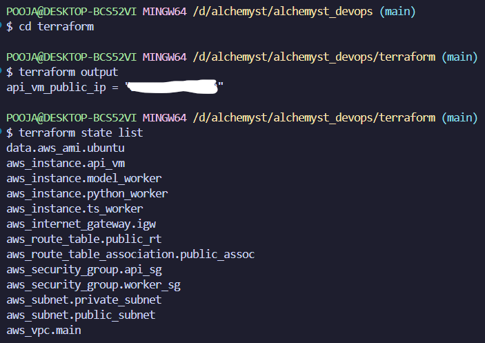
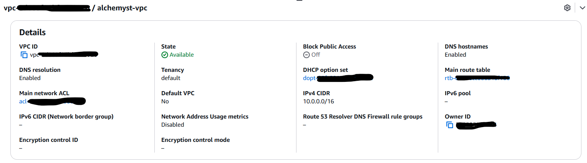
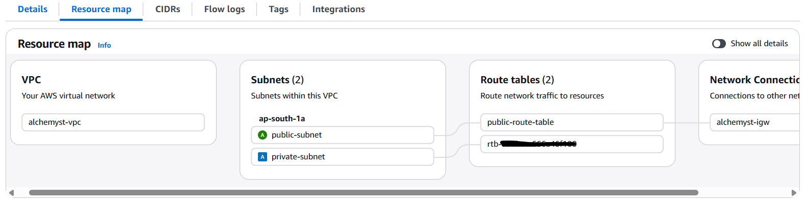
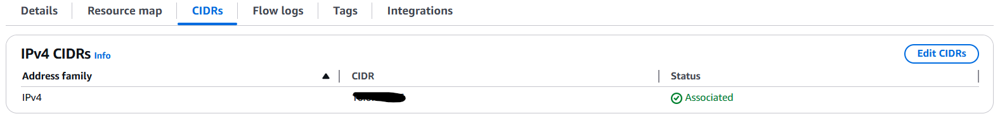
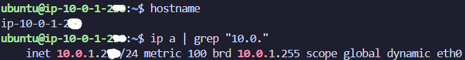
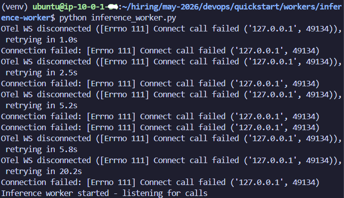
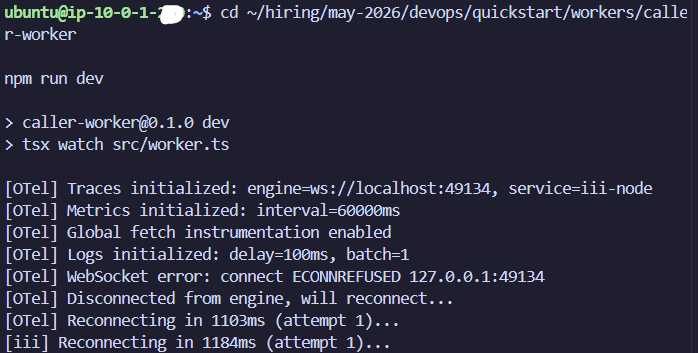

# Alchemyst AI

## Overview

This project demonstrates the deployment of a distributed inference architecture using Terraform, AWS infrastructure, Python-based inference workers, and TypeScript-based caller workers.

The system was provisioned on AWS using Infrastructure as Code principles and deployed across public and private subnets within a custom VPC.

---

# Architecture

# Architecture Diagram

                              Internet
                                  |
                                  |
                           SSH (Port 22)
                                  |
                    +-------------------------+
                    |     Public EC2 VM       |
                    |  API / Caller Worker    |
                    |-------------------------|
                    | Public IP: 13.x.x.x     |
                    | Private IP: 10.0.1.---  |
                    | Subnet: 10.0.1.0/24     |
                    | Node.js + TypeScript    |
                    +-------------------------+
                                  |
                     Internal VPC Communication
                              (10.0.0.0/16)
                                  |
                    +-------------------------+
                    |    Model Worker VM      |
                    |  Python Inference Node  |
                    |-------------------------|
                    | Private IP: 10.0.2.---  |
                    | Subnet: 10.0.2.0/24     |
                    | Python + Transformers   |
                    | distilgpt2 Model        |
                    +-------------------------+

## Components

| Component                | Purpose                                                       |
| ------------------------ | ------------------------------------------------------------- |
| API VM (Public Subnet)   | Acts as the public-facing access point and caller-worker host |
| Python Inference Worker  | Hosts the inference model and handles inference requests      |
| TypeScript Caller Worker | Handles request forwarding and worker communication           |
| Custom VPC               | Provides isolated networking environment                      |
| Security Groups          | Controls SSH, HTTP, ICMP, and internal worker communication   |

---

# Infrastructure Details

## AWS Resources Provisioned

* Custom VPC (`10.0.0.0/16`)
* Public Subnet (`10.0.1.0/24`)
* Private Subnet (`10.0.2.0/24`)
* Internet Gateway
* Route Tables
* Security Groups
* Public API EC2 Instance
* Private Worker EC2 Instances
* Model Worker EC2 Instance

---

# Terraform

Infrastructure provisioning was fully automated using Terraform.

## Provisioned Resources

* VPC
* Subnets
* Route Tables
* Security Groups
* EC2 Instances
* Internet Gateway

Terraform state and outputs verified successful provisioning.

---

# Networking Architecture

## Public Subnet

The API VM was deployed inside the public subnet with:

* Public IP assignment
* SSH access
* HTTP access

## Private Subnet

Worker instances were deployed inside the private subnet and accessed only through the public VM.

Internal communication between workers was verified successfully.

---

# Security Configuration

## API Security Group

Allowed:

* SSH (22)
* HTTP (80)

## Worker Security Group

Allowed:

* Internal SSH
* Internal ICMP (Ping)
* Internal TCP traffic for worker communication

---

# Worker Deployment

## Python Inference Worker

The inference worker was deployed on a separate EC2 instance.

### Initial Issues

The original repository configuration attempted to load:

* `gemma-3-270m-GGUF`

However:

* GGUF compatibility issues occurred
* Transformers version conflicts occurred
* NumPy compatibility issues occurred
* The provided model architecture was unsupported in the environment

### Resolution

The inference worker was adapted to use:

* `distilgpt2`

This allowed successful:

* Model download
* Worker initialization
* Inference runtime startup

Inference worker startup was verified successfully.

---

## TypeScript Caller Worker

The TypeScript caller-worker was successfully deployed and executed.

### Verified:

* Node.js environment
* npm dependency installation
* Worker startup logs
* Runtime initialization

---

# Connectivity Verification

The following connectivity checks were verified successfully:

* Public VM SSH access
* SSH hop from public VM to private worker VM
* Internal ping between worker nodes
* Private subnet communication

---

# Runtime Limitation

The provided assignment repository contains:

* Python worker SDK integration
* TypeScript worker SDK integration

However, the actual III orchestration runtime/engine was not included in:

* the repository
* npm package references
* installation instructions

As a result:

* workers continuously attempted to reconnect to `ws://localhost:49134`
* the orchestration engine could not be started locally

Despite this limitation, the following were completed successfully:

* infrastructure provisioning
* distributed worker deployment
* networking setup
* inter-node communication
* worker initialization
* dependency troubleshooting
* resource optimization

---

# Challenges Solved

## Infrastructure Challenges

* Public/private subnet routing
* Security group configuration
* SSH jump-host setup
* Internal VPC communication

## Resource Challenges

* Disk space exhaustion
* Swap creation
* Dependency installation failures
* EC2 sizing optimization

## Dependency Challenges

* GGUF runtime incompatibility
* Transformers package conflicts
* NumPy compatibility issues
* Missing runtime dependencies

---

# Skills Demonstrated

* Terraform
* AWS Networking
* EC2 Management
* Linux Administration
* SSH Tunneling
* Security Groups
* Infrastructure Troubleshooting
* Python Environment Management
* Node.js Environment Setup
* Distributed Systems Debugging
* DevOps Troubleshooting

---

# Evidence Collected

The following evidence/screenshots were collected:

* Terraform apply success
* VPC configuration
* Public/private subnet setup
* Security group configuration
* SSH into public VM
* SSH hop into private VM
* Internal ping verification
* Inference worker startup
* TypeScript worker startup
* Worker connectivity attempts

---

# Conclusion

The assignment successfully demonstrates:

* Infrastructure as Code deployment
* Distributed system setup
* Worker-based architecture deployment
* AWS networking configuration
* Multi-VM communication
* Runtime debugging and troubleshooting

Although the proprietary III runtime engine was unavailable, the infrastructure and distributed worker deployment were implemented and validated successfully.